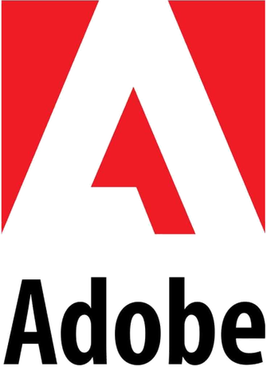
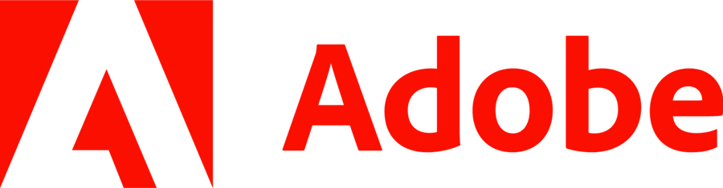
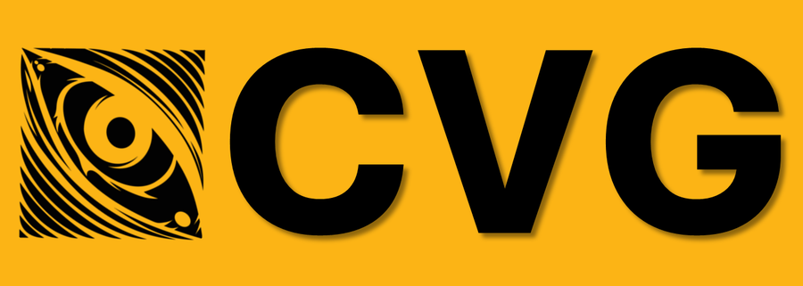

(intro)=
# Naresh Kumar Devulapally

<div class="nav-links">
  <a href="./intro.html">About Me</a>
  <a href="./publications.html">Publications</a>
  <a href="./course_notes/my-teaching-philosophy.html">My Teaching</a>
</div>

---

I am a PhD candidate in Computer Science and Engineering at the University at Buffalo, SUNY, advised by [Dr. Vishnu Lokhande](https://vlokhande-ub.github.io). I am currently a Research Scientist Intern at [Adobe Research](https://research.adobe.com/).

```{admonition} Currently on the job market
:class: important
I am actively looking for **postdoctoral** and **research scientist** positions starting **February 2027**. Please email me at <a href="mailto:devulapa@buffalo.edu">devulapa@buffalo.edu</a> or <a href="mailto:devulapally.phd@gmail.com">devulapally.phd@gmail.com</a>.

<div class="ie-cols">
  <div>
    <div class="ie-head">Interests</div>
    <ul class="ie-list">
      <li>Image/Video Generation and Editing</li>
      <li>Content Provenance/Watermarking</li>
      <li>Hallucination Detection and Mitigation</li>
      <li>Model Interpretability</li>
      <li>Vision-Language-Action/World Models</li>
      <li>Multi-Modal Learning</li>
    </ul>
  </div>
  <div>
    <div class="ie-head">Experience</div>
    <div class="ie-entry">
      
      <div>
        <div class="ie-title">Research Scientist Intern, <strong>2026 - Present</strong></div>
        <div class="ie-note">Shipping a multimodal watermarking model.</div>
      </div>
    </div>
    <div class="ie-entry">
      
      <div>
        <div class="ie-title">Ph.D. Research Assistant, <strong>2024 - Present</strong></div>
        <div class="ie-note">Published at <strong>CVPR 26, ICCV 25, AAAI 26, WACV 26</strong> and <strong>CoLM 26</strong>.</div>
      </div>
    </div>
    <div class="ie-entry">
      
      <div>
        <div class="ie-title">Senior Data Scientist, <strong>2020 - 2022</strong></div>
        <div class="ie-note">Production AI for Unilever, BOSCH and DOLE.</div>
      </div>
    </div>
  </div>
</div>
```

```{admonition} Research Focus
:class: tip
My research focuses on [controlling diffusion models](https://slides.com/naresh-ub/phd-dissertation-slides) during generation to understand their **representations**, **improve reliability**, and establish the **provenance** of generated content. My work spans images, video, and language, including text-to-image diffusion models, diffusion language models, and diffusion vision-language models.

::::{grid} 1
:gutter: 3

:::{grid-item-card} {octicon}`shield-lock;1.15em;sd-text-primary sd-mr-2` AI Provenance: Watermarking and Content Protection
:shadow: sm

How can we establish the provenance of generated media and protect creators against unauthorized personalization?

+++
{bdg-dark}`ICCV 2025`  [Your Text Encoder can be an Object-Level Watermarking Controller](https://research.adobe.com/publication/your-text-encoder-can-be-an-object-level-watermarking-controller/)

{bdg-dark}`ACM MM 2025`   [Protecting against Unauthorized Latent Diffusion Personalization through Trajectory Shifted Perturbations](https://dl.acm.org/doi/10.1145/3746027.3755112)
:::

:::{grid-item-card} {octicon}`telescope;1.15em;sd-text-info sd-mr-2` Interpretability: Representations to Textual Explanations
:shadow: sm

How can we uncover the representations underlying a model's outputs and turn them into textual explanations?

+++
{bdg-dark}`CVPR 2026`  [Interpretable Hard Prompt Inversion made Edit-Friendly via Token-to-Token Similarity Reduction in dLLMs](https://openaccess.thecvf.com/content/CVPR2026/papers/Devulapally_Interpretable_Prompts_made_Edit-Friendly_Token-to-Token_Similarity_Reduction_in_dLLMs_for_CVPR_2026_paper.pdf)
:::

:::{grid-item-card} {octicon}`check-circle;1.15em;sd-text-success sd-mr-2` Reliability: Hallucination Mitigation
:shadow: sm

How can we detect and correct hallucinations during generation in diffusion language and vision-language models?

+++
{bdg-dark}`CoLM 2026`  [OSCAR: Orchestrated Self-verification and Cross-path Refinement](https://arxiv.org/abs/2604.01624)

{bdg-dark}`Preprint`  [Score-Control for Hallucination Reduction in Diffusion Models](https://arxiv.org/abs/2606.00377)
:::

::::
```


Previously, I completed my MS in Computer Science at the University at Buffalo, working on [robust multimodal learning](https://cse.buffalo.edu/tech-reports/2024-11.pdf) for video emotion recognition with [Dr. Junsong Yuan](https://cse.buffalo.edu/~jsyuan/) and [Dr. Sreyasee Das Bhattacharjee](https://cse.buffalo.edu/~sreyasee/), published at `ACM Multimedia 2023`, `BigMM 2023` and `ICME 2024`. Before graduate school I spent two and a half years as a Data Scientist III, building and deploying production machine learning systems. I studied Mechanical Engineering at NIT Tiruchirappalli.

## Collaborators

<div class="collab-cols">
  <div class="collab-col">
    <div class="collab-item">
      
      <a href="https://www.collomosse.com/" target="_blank" rel="noopener noreferrer">Dr. John Collomosse</a>
    </div>
    <div class="collab-item">
      
      <a href="https://research.adobe.com/person/shruti-agarwal/" target="_blank" rel="noopener noreferrer">Dr. Shruti Agarwal</a>
    </div>
    <div class="collab-item">
      
      <a href="https://vishal3477.github.io/" target="_blank" rel="noopener noreferrer">Dr. Vishal Asnani</a>
    </div>
    <div class="collab-item">
      
      <a href="https://www.tejasgokhale.com/" target="_blank" rel="noopener noreferrer">Dr. Tejas Gokhale</a>
    </div>
    <div class="collab-item">
      
      <a href="https://vgupta123.github.io/" target="_blank" rel="noopener noreferrer">Dr. Vivek Gupta</a>
    </div>
  </div>
  <div class="collab-col">
    <div class="collab-item">
      
      <a href="https://cse.buffalo.edu/~siweilyu/index.html" target="_blank" rel="noopener noreferrer">Dr. Siwei Lyu</a>
    </div>
    <div class="collab-item">
      
      <a href="https://cse.buffalo.edu/~jsyuan/" target="_blank" rel="noopener noreferrer">Dr. Junsong Yuan</a>
    </div>
    <div class="collab-item">
      
      <a href="https://cse.buffalo.edu/~doermann/index.html" target="_blank" rel="noopener noreferrer">Dr. David Doermann</a>
    </div>
    <div class="collab-item">
      
      <a href="https://cse.buffalo.edu/~nratha/" target="_blank" rel="noopener noreferrer">Dr. Nalini Ratha</a>
    </div>
    <div class="collab-item">
      
      <a href="https://cse.buffalo.edu/~kaiyiji/" target="_blank" rel="noopener noreferrer">Dr. Kaiyi Ji</a>
    </div>
  </div>
</div>

<h2 id="publications"><a href="./publications.html">Publications</a></h2>

<div class="pub-scroll" role="region" aria-label="Publications">
    <div class="pub-item">
      <span class="pub-venue">CVPR 2026</span>
      <div class="pub-body">
        <div class="pub-title"><a href="https://openaccess.thecvf.com/content/CVPR2026/papers/Devulapally_Interpretable_Prompts_made_Edit-Friendly_Token-to-Token_Similarity_Reduction_in_dLLMs_for_CVPR_2026_paper.pdf">Interpretable Hard Prompt Inversion made Edit-Friendly via Token-to-Token Similarity Reduction in dLLMs</a></div>
        <div class="pub-authors"><b>Naresh Kumar Devulapally</b>, Shruti Agarwal, Vishal Asnani, Vishnu Suresh Lokhande</div>
      </div>
    </div>
    <div class="pub-item">
      <span class="pub-venue">AAAI 2026</span>
      <div class="pub-body">
        <div class="pub-title"><a href="https://ojs.aaai.org/index.php/AAAI/article/view/37481">Forget Less by Learning from Parents Through Hierarchical Relationships</a></div>
        <div class="pub-authors">Arjun Ramesh Kaushik, <b>Naresh Kumar Devulapally</b>, Vishnu Suresh Lokhande, Nalini Ratha, Venugopal Govindaraju</div>
      </div>
    </div>
    <div class="pub-item">
      <span class="pub-venue">WACV 2026</span>
      <div class="pub-body">
        <div class="pub-title"><a href="https://openaccess.thecvf.com/content/WACV2026/html/Kaushik_Forget_Less_by_Learning_Together_through_Concept_Consolidation_WACV_2026_paper.html">Forget Less by Learning Together through Concept Consolidation</a></div>
        <div class="pub-authors">Arjun Ramesh Kaushik, <b>Naresh Kumar Devulapally</b>, Vishnu Suresh Lokhande, Nalini Ratha, Venugopal Govindaraju</div>
      </div>
    </div>
    <div class="pub-item">
      <span class="pub-venue">CoLM 2026</span>
      <div class="pub-body">
        <div class="pub-title"><a href="https://arxiv.org/abs/2604.01624">OSCAR: Orchestrated Self-verification and Cross-path Refinement</a></div>
        <div class="pub-authors">Yash Shah, Abhijit Chakraborty, <b>Naresh Kumar Devulapally</b>, Vishnu Suresh Lokhande, Vivek Gupta</div>
      </div>
    </div>
    <div class="pub-item">
      <span class="pub-venue">Preprint</span>
      <div class="pub-body">
        <div class="pub-title"><a href="https://arxiv.org/abs/2606.00377">Score-Control for Hallucination Reduction in Diffusion Models</a></div>
        <div class="pub-authors">Mahesh Bhosale<span class="eq">*</span>, <b>Naresh Kumar Devulapally</b><span class="eq">*</span>, Abdul Wasi, Chau Pham, Vishnu Suresh Lokhande, David Doermann</div>
      </div>
    </div>
    <div class="pub-item">
      <span class="pub-venue">ACM MM 2025</span>
      <div class="pub-body">
        <div class="pub-title"><a href="https://dl.acm.org/doi/10.1145/3746027.3755112">Protecting against Unauthorized Latent Diffusion Personalization through Trajectory Shifted Perturbations</a></div>
        <div class="pub-authors"><b>Naresh Kumar Devulapally</b>, Shruti Agarwal, Tejas Gokhale, Vishnu Suresh Lokhande</div>
      </div>
    </div>
    <div class="pub-item">
      <span class="pub-venue">ICCV 2025</span>
      <div class="pub-body">
        <div class="pub-title"><a href="https://openaccess.thecvf.com/content/ICCV2025/html/Devulapally_Your_Text_Encoder_Can_Be_An_Object-Level_Watermarking_Controller_ICCV_2025_paper.html">Your Text Encoder Can Be An Object-Level Watermarking Controller</a></div>
        <div class="pub-authors"><b>Naresh Kumar Devulapally</b>, Mingzhen Huang, Vishal Asnani, Shruti Agarwal, Siwei Lyu, Vishnu Suresh Lokhande</div>
      </div>
    </div>
    <div class="pub-item">
      <span class="pub-venue">ICME 2024</span>
      <div class="pub-body">
        <div class="pub-title"><a href="https://arxiv.org/abs/2402.10921">Adaptive Missing-Modality Emotion Recognition in Conversations via Joint Embedding Learning</a></div>
        <div class="pub-authors"><b>Naresh Kumar Devulapally</b>, Sidharth Anand, Sreyasee Das Bhattacharjee, Junsong Yuan</div>
      </div>
    </div>
    <div class="pub-item">
      <span class="pub-venue">ACM MM 2023</span>
      <div class="pub-body">
        <div class="pub-title"><a href="https://dl.acm.org/doi/10.1145/3581783.3612517">Multi-label Emotion Analysis in Conversation via Multimodal Knowledge Distillation</a></div>
        <div class="pub-authors"><b>Naresh Kumar Devulapally</b>, Sidharth Anand, Sreyasee Das Bhattacharjee, Junsong Yuan</div>
      </div>
    </div>
    <div class="pub-item">
      <span class="pub-venue">BigMM 2023</span>
      <div class="pub-body">
        <div class="pub-title"><a href="https://ieeexplore.ieee.org/abstract/document/10411802">AMuSE: Adaptive Multimodal Analysis for Speaker Emotion Recognition in Group Conversations</a></div>
        <div class="pub-authors"><b>Naresh Kumar Devulapally</b>, Sidharth Anand, Sreyasee Das Bhattacharjee, Junsong Yuan</div>
      </div>
    </div>
</div>

## Teaching

<div class="teach-links">
  <a href="./course_notes/my-teaching-philosophy.html">My Teaching Philosophy</a>
  <a href="https://www.ratemyprofessors.com/professor/3113460">RateMyProfessor Ratings</a>
</div>

```{admonition} CSE Graduate Teaching Award, 2025
:class: tip
Received the <a href="https://arc.net/l/quote/fxgsjydt">CSE Graduate Teaching Award</a> at the University at Buffalo for **CSE 4/573: Computer Vision and Image Processing**, the first course at UB to include a semester-long module on diffusion models.

<div class="teach-list">
  <div class="teach-item">
    <span class="teach-role">Instructor</span>
    <div class="teach-body">
      <div class="teach-title"><a href="https://naresh-devula.github.io/cvip-summer25">CSE 4/573: Computer Vision and Image Processing</a></div>
      <div class="teach-meta">University at Buffalo &nbsp;·&nbsp; Summer 2025 &nbsp;·&nbsp; 71 students</div>
      <div class="teach-note">Built the full course from scratch, from classical image formation through VAEs, GANs and diffusion models.</div>
    </div>
  </div>
  <div class="teach-item">
    <span class="teach-role">Instructor</span>
    <div class="teach-body">
      <div class="teach-title"><a href="https://naresh-devula.github.io/cvip-summer26">CSE 4/573: Computer Vision and Image Processing</a></div>
      <div class="teach-meta">University at Buffalo &nbsp;·&nbsp; Summer 2026</div>
    </div>
  </div>
  <div class="teach-item">
    <span class="teach-role">Guest Lecture</span>
    <div class="teach-body">
      <div class="teach-title"><a href="./guest_lectures/spring_2026/intro.html">CSE 555: Pattern Recognition, Diffusion Models</a></div>
      <div class="teach-meta">Instructor: Prof. Ifeoma Nwogu</div>
    </div>
  </div>
  <div class="teach-item">
    <span class="teach-role">Guest Lecture</span>
    <div class="teach-body">
      <div class="teach-title">CSE 573: Computer Vision, CNNs and Diffusion Models</div>
      <div class="teach-meta">Instructor: Prof. Junsong Yuan</div>
    </div>
  </div>
</div>

```

## News

<div class="news-scroll" role="region" aria-label="Recent news">
  <ul class="news-list">
    <li>
      👨🏻‍🏫 Invited <a href="./guest_lectures/spring_2026/intro.html">Guest Lectures</a> on Diffusion Models in CSE 555: Pattern Recognition course at UB.
      <ul>
        <li><em>Instructor: Prof. Ifeoma Nwogu.</em></li>
      </ul>
    </li>
    <li>
      🎉 <a href="#">Token-to-Token Similarity Reduction in dLLMs for Edit-Friendly Hard Prompt Inversion</a> is accepted to <strong>CVPR 2026</strong>!
    </li>
    <li>
      👨🏻‍🏫 Invited <a href="#">Guest Lectures</a> on CNNs and Diffusion Models in CSE 573: Computer Vision course at UB. 
      <ul>
        <li><em>Instructor: Prof. Junsong Yuan.</em></li>
      </ul>
    </li>
    <li>
      🎉 Recipient of <a href="https://arc.net/l/quote/fxgsjydt">CSE Graduate Teaching Award</a> for my Summer CVIP course at UB.
    </li>
    <li>
      🎉 Passed Oral Qualifying Examination at UB!
    </li>
    <li>
      👨🏻‍🏫 Taught CSE 4/573: <a href="https://naresh-devula.github.io/cvip-summer25">Computer Vision and Image Processing</a> at UB, <strong>Summer 2025</strong>.
    </li>
    <li>
      🎉 <a href="https://openaccess.thecvf.com/content/ICCV2025/html/Devulapally_Your_Text_Encoder_Can_Be_An_Object-Level_Watermarking_Controller_ICCV_2025_paper.html">Your Text Encoder can be an Object-Level Watermarking Controller</a> is accepted at <strong>ICCV 2025</strong>!
      <ul>
        <li>(with: <a href="https://research.adobe.com/publication/your-text-encoder-can-be-an-object-level-watermarking-controller/">Adobe Research</a>, <a href="https://arc.net/l/quote/zgjwmrzi">Prof. Siwei Lyu</a>).</li>
      </ul>
    </li>
    <li>
      🎉 <a href="https://dl.acm.org/doi/10.1145/3746027.3755112">Protecting against Unauthorized Latent Diffusion Personalization through Trajectory Shifted Perturbations</a> is accepted at <strong>ACM MM 2025</strong>!
      <ul>
        <li>(with: Adobe Research, <a href="https://arc.net/l/quote/sfgeqwly">CVG at UMBC</a>).</li>
      </ul>
    </li>
  </ul>
</div>

## Contact

::::{grid} 1 1 2 2
:gutter: 2

:::{grid-item}
{octicon}`location;1em;sd-mr-1` 301C Davis Hall, Buffalo NY, 14260
:::
:::{grid-item}
{octicon}`mail;1em;sd-mr-1` [devulapa@buffalo.edu](mailto:devulapa@buffalo.edu)
:::
::::

<head>
  <link rel="stylesheet" href="https://cdnjs.cloudflare.com/ajax/libs/font-awesome/6.4.2/css/all.min.css">
  <style>
    .social-icons a {
      text-decoration: none; /* Removes underlines */
      display: inline-block; /* Ensures proper spacing */
      margin: 15px; /* Increased spacing between icons */
    }
    .social-icons {
      text-align: center;
      font-size: 45px; /* Slightly bigger icons */
    }
  </style>
</head>

<div class="social-icons">
  <a href="mailto:devulapa@buffalo.edu" style="color: green;">
    <i class="fa-solid fa-envelope"></i>
  </a>
  <a href="https://scholar.google.com/citations?user=20vLrzMAAAAJ&hl=en" style="color: #4285F4;">
    <i class="fa-brands fa-google-scholar"></i>
  </a>
  <a href="https://github.com/naresh-devula" style="color: green;">
    <i class="fa-brands fa-github"></i>
  </a>
  <a href="https://www.linkedin.com/in/nareshdevulapally" style="color: #0A66C2;">
    <i class="fa-brands fa-linkedin"></i>
  </a>
  <!-- <a href="#" style="color: black;">
    <i class="fa-brands fa-x-twitter"></i>
  </a> -->
</div>

<div class="visitor-map">
  <script type="text/javascript" id="mapmyvisitors"
    src="https://mapmyvisitors.com/map.js?d=TRY7vM8eKxPG8y_FA_4ZyVgL7ZQxEht4ET8dFtGh9p8&cl=ffffff&w=220&t=n"></script>
  <noscript><a href="https://mapmyvisitors.com/web/1c8gc" rel="noopener noreferrer">Visitor map</a></noscript>
</div>

