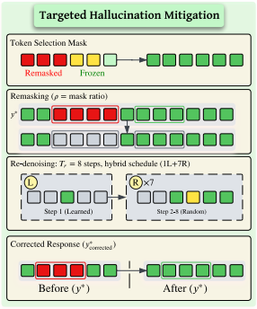
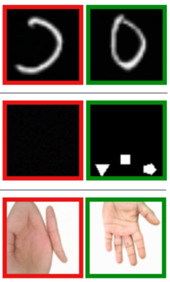

# 📃 Publications

  <a href="./intro.html">About Me</a>
  <a href="./publications.html">Publications</a>
  <a href="./course_notes/my-teaching-philosophy.html">My Teaching</a>

___

* Corresponding Author(s). &nbsp;&nbsp; &dagger; Equal Contribution.
Also on [Google Scholar](https://scholar.google.com/citations?user=20vLrzMAAAAJ) and [DBLP](https://dblp.org/pid/359/4220.html).

  
  

    

    <a href="https://openaccess.thecvf.com/content/CVPR2026/papers/Devulapally_Interpretable_Prompts_made_Edit-Friendly_Token-to-Token_Similarity_Reduction_in_dLLMs_for_CVPR_2026_paper.pdf">
    Interpretable Hard Prompt Inversion made Edit-Friendly via Token-to-Token Similarity Reduction in dLLMs
    </a>
    

    
<b>Naresh Kumar Devulapally</b>*, Shruti Agarwal, Vishal Asnani, Vishnu Suresh Lokhande*

    
<i>IEEE/CVF Conference on Computer Vision and Pattern Recognition (<b>CVPR 2026</b>)</i>

    

      <a href="https://openaccess.thecvf.com/content/CVPR2026/papers/Devulapally_Interpretable_Prompts_made_Edit-Friendly_Token-to-Token_Similarity_Reduction_in_dLLMs_for_CVPR_2026_paper.pdf">Paper</a>
      <a href="https://slides.com/naresh-ub/prompt-inversion-llada">Slides</a>
      <a href="">Code (Soon)</a>
    

  

  
  

    

    <a href="https://ojs.aaai.org/index.php/AAAI/article/view/37481">
    Forget Less by Learning from Parents Through Hierarchical Relationships
    </a>
    

    
Arjun Ramesh Kaushik*, <b>Naresh Kumar Devulapally</b>, Vishnu Suresh Lokhande, Nalini Ratha, Venugopal Govindaraju

    
<i>The 40th Annual AAAI Conference on Artificial Intelligence (<b>AAAI 2026</b>)</i>

    

      <a href="https://ojs.aaai.org/index.php/AAAI/article/view/37481">Paper</a>
      <a href="">Code (Soon)</a>
    

  

  
  

    

    <a href="https://openaccess.thecvf.com/content/WACV2026/html/Kaushik_Forget_Less_by_Learning_Together_through_Concept_Consolidation_WACV_2026_paper.html">
    Forget Less by Learning Together through Concept Consolidation
    </a>
    

    
Arjun Ramesh Kaushik*, <b>Naresh Kumar Devulapally</b>, Vishnu Suresh Lokhande, Nalini Ratha, Venugopal Govindaraju

    
<i>IEEE/CVF Winter Conference on Applications of Computer Vision (<b>WACV 2026</b>)</i>

    

      <a href="https://openaccess.thecvf.com/content/WACV2026/html/Kaushik_Forget_Less_by_Learning_Together_through_Concept_Consolidation_WACV_2026_paper.html">Paper</a>
      <a href="">Code (Soon)</a>
    

  

  
  

    

    <a href="https://arxiv.org/abs/2604.01624">
    OSCAR: Orchestrated Self-verification and Cross-path Refinement
    </a>
    

    
Yash Shah, Abhijit Chakraborty, <b>Naresh Kumar Devulapally</b>, Vishnu Suresh Lokhande, Vivek Gupta

    
<i>Conference on Language Modeling (<b>CoLM 2026</b>)</i>

    

      <a href="https://arxiv.org/abs/2604.01624">Paper</a>
      <a href="https://arxiv.org/abs/2604.01624">arXiv</a>
    

  

  
  

    

    <a href="https://arxiv.org/abs/2606.00377">
    Score-Control for Hallucination Reduction in Diffusion Models
    </a>
    

    
Mahesh Bhosale&dagger;, <b>Naresh Kumar Devulapally</b>&dagger;, Abdul Wasi, Chau Pham, Vishnu Suresh Lokhande, David Doermann

    
<i><b>Preprint</b>, 2026</i>

    

      <a href="https://arxiv.org/abs/2606.00377">Paper</a>
      <a href="https://arxiv.org/abs/2606.00377">arXiv</a>
    

  

  
  

    

    <a href="https://dl.acm.org/doi/10.1145/3746027.3755112">
    Protecting against Unauthorized Latent Diffusion Personalization through Trajectory Shifted Perturbations
    </a>
    

    
<b>Naresh Kumar Devulapally</b>*, Shruti Agarwal, Tejas Gokhale, Vishnu Suresh Lokhande*

    
<i>33rd ACM International Conference on Multimedia (<b>ACM MM 2025</b>)</i>

    

      <a href="https://dl.acm.org/doi/10.1145/3746027.3755112">Paper</a>
      <a href="https://slides.com/naresh-ub/unlearnable-samples">Slides</a>
      <a href="https://github.com/naresh-devula">Code</a>
    

  

  
  

    

    <a href="https://openaccess.thecvf.com/content/ICCV2025/html/Devulapally_Your_Text_Encoder_Can_Be_An_Object-Level_Watermarking_Controller_ICCV_2025_paper.html">
    Your Text Encoder Can Be An Object-Level Watermarking Controller
    </a>
    

    
<b>Naresh Kumar Devulapally</b>*, Mingzhen Huang, Vishal Asnani, Shruti Agarwal, Siwei Lyu, Vishnu Suresh Lokhande*

    
<i>IEEE/CVF International Conference on Computer Vision (<b>ICCV 2025</b>)</i>

    

      <a href="https://openaccess.thecvf.com/content/ICCV2025/html/Devulapally_Your_Text_Encoder_Can_Be_An_Object-Level_Watermarking_Controller_ICCV_2025_paper.html">Paper</a>
      <a href="https://slides.com/naresh-ub/umbc-talk-watermarking">Slides</a>
      <a href="https://iccv.thecvf.com/media/PosterPDFs/ICCV%202025/1870.png?t=1759981503.377534">Poster</a>
      <a href="https://github.com/naresh-devula">Code</a>
    

  

  
  

    

    <a href="https://arxiv.org/abs/2402.10921">
    Adaptive Missing-Modality Emotion Recognition in Conversations via Joint Embedding Learning
    </a>
    

    
<b>Naresh Kumar Devulapally</b>*, Sidharth Anand, Sreyasee Das Bhattacharjee, Junsong Yuan

    
<i>IEEE International Conference on Multimedia and Expo (<b>ICME 2024</b>)</i>

    

      <a href="https://arxiv.org/abs/2402.10921">Paper</a>
      <a href="https://github.com/neuralnaresh/multimodal-emotion-recognition">Code</a>
    

  

  
  

    

    <a href="https://dl.acm.org/doi/10.1145/3581783.3612517">
    Multi-label Emotion Analysis in Conversation via Multimodal Knowledge Distillation
    </a>
    

    
<b>Naresh Kumar Devulapally</b>&dagger;, Sidharth Anand&dagger;, Sreyasee Das Bhattacharjee, Junsong Yuan

    
<i>31st ACM International Conference on Multimedia (<b>ACM MM 2023</b>)</i>

    

      <a href="https://dl.acm.org/doi/10.1145/3581783.3612517">Paper</a>
      <a href="https://github.com/neuralnaresh/multimodal-emotion-recognition">Code</a>
    

  

  
  

    

    <a href="https://ieeexplore.ieee.org/abstract/document/10411802">
    AMuSE: Adaptive Multimodal Analysis for Speaker Emotion Recognition in Group Conversations
    </a>
    

    
<b>Naresh Kumar Devulapally</b>*, Sidharth Anand, Sreyasee Das Bhattacharjee, Junsong Yuan

    
<i>IEEE International Conference on Multimedia Big Data (<b>BigMM 2023</b>)</i>

    

      <a href="https://ieeexplore.ieee.org/abstract/document/10411802">Paper</a>
      <a href="https://github.com/neuralnaresh/multimodal-emotion-recognition">Code</a>
    

  

